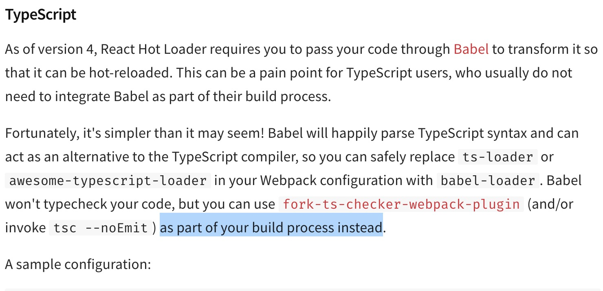

# erb-nf

*使用 electron-react-boilerplate(erb) 对原项目进行简单复刻，并且之后将在此基础上继续开发*

## electron-react-boilerplate

*A simple boilerplate for building electron app with react, typescript, css hot load, but without react Hot Module Replacement(HMR)!*

## 开发备忘

* 增加 item

### 增加 item

src/models/AppHooks.tsx 中数组添加新 item，handleSwitch 补充对应事件

src/util/lib/fuzzyMatch2.ts 中 pickItem 补充对应情况

src/App.tsx 中 ScrollList 相关 mode 补充，以及 handleEnterKey

